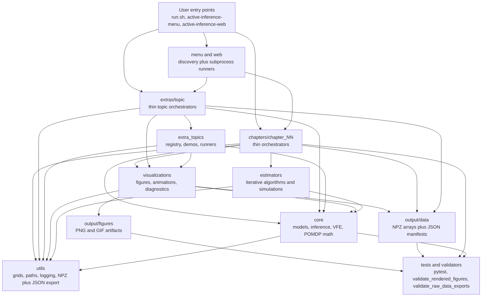

# Architecture overview

The package is organized around the *agent / environment* split that the book
emphasizes throughout Part I. Every concept gets its own small, documented
class so chapter scripts can mix and match them.

## Layered design

```
┌──────────────────────────────────────────────────────────────┐
│ chapters/<chapter>/ and extras/<topic>/                      │  thin orchestrators
│  └── 30–120 LOC scripts importing from `active_inference`    │
└──────────────────────┬───────────────────────────────────────┘
                       │
                       ▼
┌──────────────────────────────────────────────────────────────┐
│ src/active_inference/menu/      src/active_inference/web/    │  text + browser UIs
│   runner.py, tui.py               server.py, templates.py    │  stdlib-only
│   (run.sh)                        (run.sh --web)             │
└──────────────────────┬───────────────────────────────────────┘
                       │
                       ▼
┌──────────────────────────────────────────────────────────────┐
│ src/active_inference/extra_topics.py                         │  extras registry,
│   topic metadata, deterministic demos, CLI runners           │  simulations, GIFs
└──────────────────────┬───────────────────────────────────────┘
                       │
                       ▼
┌──────────────────────────────────────────────────────────────┐
│ src/active_inference/visualizations/                         │  static + interactive
│   plotting.py, variational.py, unified.py,                   │  matplotlib helpers,
│   interactive.py, animations.py, diagnostics.py,             │  GIF / slider widgets,
│   style.py                                                   │  diagnostic figures
└──────────────────────┬───────────────────────────────────────┘
                       │
                       ▼
┌──────────────────────────────────────────────────────────────┐
│ src/active_inference/estimators/                             │  point estimates +
│   mle.py, map.py, gradient_descent.py,                       │  variational / PC
│   linear_regression.py, em.py, variational.py,               │  (analytic + iterative)
│   predictive_coding.py, continuous_learning.py,              │
│   generalized_filtering.py, active_inference.py, pomdp.py    │
└──────────────────────┬───────────────────────────────────────┘
                       │
                       ▼
┌──────────────────────────────────────────────────────────────┐
│ src/active_inference/core/                                   │  exact Bayesian
│   distributions.py, generative_process.py,                   │  inference + diagnostics
│   generative_model.py, inference.py, lgs.py,                 │  + VFE / predictive coding
│   compose.py, diagnostics.py, posterior.py,                  │
│   types.py, validators.py, variational.py, thermodynamics.py,│
│   free_energy_forms.py, factor_graph.py, ergodic.py,         │
│   predictive_coding.py, continuous_learning.py,              │
│   generalized_filtering.py, active_inference.py, pomdp.py    │
└──────────────────────┬───────────────────────────────────────┘
                       │
                       ▼
┌──────────────────────────────────────────────────────────────┐
│ src/active_inference/utils/                                  │  grids, logging, paths
│   grids.py, logging.py, io.py, export.py                     │
└──────────────────────────────────────────────────────────────┘
```

Higher layers depend only on lower layers; layers never import one another
sideways. This keeps the dependency graph acyclic and lets you swap out, say,
the inference engine without touching the chapter scripts.

## Dependency and artifact flow

The implementation has two linked flows: import dependencies point downward
through the library layers, while rendered artifacts and raw-data sidecars flow
out from chapter and extras scripts into `output/` and are checked by validators.



## Key types

| Class                        | File                            | Role |
|------------------------------|---------------------------------|------|
| `GenerativeProcess`          | `core/generative_process.py`    | Samples scalar observations from a chosen generating function. |
| `LinearGaussianProcess`      | same                            | Univariate linear-Gaussian specialization (optional nonlinear `psi`). |
| `LinearGaussianMVProcess`    | same                            | Multivariate ``y = Θ x* + b + ω`` with arbitrary covariance. |
| `GenerativeModel`            | `core/generative_model.py`      | Abstract ``log_likelihood`` / ``log_prior`` interface. |
| `LinearGaussianModel`        | same                            | Univariate agent (Gaussian or uniform prior). |
| `LinearGaussianMVModel`      | same                            | Multivariate agent with full-covariance prior and likelihood. |
| `GridBayesianInference`      | `core/inference.py`             | Exact posterior via grid + trapezoid integration. |
| `InferenceResult`            | same                            | Posterior diagnostic helpers (mode, mean, variance, CI, entropy, KL). |
| `LinearGaussianSystem`       | `core/lgs.py`                   | Closed-form MVN ↔ MVN posterior; single + batched updates. |
| `LGSPosterior`               | same                            | Posterior mean + covariance with `std()`/`precision`. |
| `Pipeline`                   | `core/compose.py`               | One-shot wiring of process + model + grid inference. |
| `RunningPosteriorStats`      | `core/compose.py`               | Online posterior trace for animations / diagnostics. |
| `Posterior` (protocol)       | `core/posterior.py`             | Structural type satisfied by `InferenceResult`, `LGSPosterior`, `BLRPosterior`. |
| `ThermodynamicState`         | `core/thermodynamics.py`        | Explicit `U`, `S`, `T`, `p`, `V` bridge; at `T=1,pV=0`, `U-TS` equals VFE. |
| `FreeEnergyForm`             | `core/free_energy_forms.py`     | Named Part III free-energy teaching decomposition with scalar total and additive terms. |
| `EntropyBound`               | `core/ergodic.py`               | Entropy quantity, VFE-like upper bound, and residual gap for FEP extras. |
| `ExtraTopicSpec`             | `extra_topics.py`               | Registry metadata for a book-grounded extras topic, including family, sections, and artifact modes. |
| `CalibrationCurve`           | `core/diagnostics.py`           | Empirical vs nominal coverage at chosen credible levels. |
| `PosteriorPredictiveCheck`   | `core/diagnostics.py`           | Replicated-statistic Bayesian p-value. |
| `BayesianLinearRegression`   | `estimators/linear_regression.py`| Conjugate Gaussian update with `fit`, `fit_sequential`, predictive bands. |
| `BLRPosterior` / `GDRegressionResult` | same                   | Posterior over θ; iterate / loss history. |
| `FactorAnalysisResult`       | `estimators/em.py`              | Final loadings, posteriors, log-likelihood trace. |
| `GradientDescentResult`      | `estimators/gradient_descent.py`| Iterate / loss history of a 1-D descent run. |
| `LearningAttentionModel`     | `core/continuous_learning.py`   | Chapter 8 hidden-state, parameter, and log-precision free-energy model. |
| `LearningAttentionResult`    | `estimators/continuous_learning.py` | Perception, learning, attention, and VFE traces for Chapter 8. |
| `HierarchicalContinuousModel`| `core/continuous_learning.py`   | Two-layer continuous hierarchy with top-down context and message terms. |
| `GeneralizedVectorModel`     | `core/generalized_filtering.py` | Chapter 6 vector generalized-coordinate model with correlated embedding-order precision. |
| `MultivariateActiveInferenceAgent` | `core/active_inference.py` | Chapter 7 vector action-perception agent in generalized coordinates. |
| `MultivariateActiveInferenceResult` | `estimators/active_inference.py` | Vector state, belief, action, generalized measurement, error, and VFE traces. |
| `ChapterEntry` / `ExtraTopicEntry` / `ScriptEntry` | `menu/runner.py` | Discovered chapter or extras folder + runnable script descriptor. |

See [`reference/`](reference/) for a full per-subpackage API catalogue.

## Conventions

- All variances are *variances*, not standard deviations.
- All densities are evaluated on a 1-D NumPy grid and integrated with the
  trapezoid rule (`np.trapezoid`); this is sufficient for the scalar Part-I
  examples.
- Every chapter and extras script accepts `--save` for headless rendering;
  stochastic scripts also accept `--seed` for reproducibility.
- Extras static, simulation, and animation scripts follow the
  `visualize_*.py` / `simulate_*.py` / `animation_*.py` naming convention and
  are validated against `docs/reference/book_topic_matrix.md`.
- Random number generators are passed in explicitly via `numpy.random.Generator`
  — no global state.
- The `menu/` subpackage is stdlib-only — no `numpy`/`matplotlib` imports.

## Environment / tooling

- **uv** is the recommended package manager. `uv sync` installs the
  environment from `uv.lock`; `uv run <cmd>` invokes commands inside it
  without manual activation. The top-level [`run.sh`](../run.sh) prefers
  `uv run` and falls back to `python3`/`python` if `uv` is unavailable.
- `pyproject.toml` is the single source of truth for dependencies. The
  `[dependency-groups]` table holds the `dev` group consumed by uv; the
  `[project.optional-dependencies]` table mirrors `dev` so `pip install -e
  ".[dev]"` still works.
- `requirements.txt` is kept for legacy `pip install -r` users; the
  authoritative source is `pyproject.toml`.

## Adding a new example

1. Add a method or class to the appropriate `core/` or `estimators/` module
   (with tests in `tests/<sub>/`).
2. Drop a thin orchestrator into `chapters/chapter_<N>/` or
   `extras/<topic>/` that imports your new helper. The script should be
   ≤ ~120 lines.
3. Document it in the chapter's concept map
   [`docs/chapters/chapter_<N>.md`](chapters/) and the in-tree
   `chapters/chapter_<N>/README.md`, or in `extras/<topic>/README.md` for an
   extras topic. The [`run.sh`](../run.sh) menu, chapter smoke tests, and
   extras smoke tests will pick it up automatically as long as it follows the
   `example_*.py` / `animation_*.py` / `simulate_*.py` / `visualize_*.py`
   naming convention and accepts `--save`.
