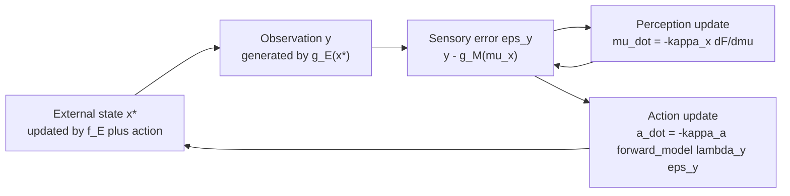

# Chapter 7 — concept map

Chapter 6 gave the agent *perception*. Chapter 7 closes the loop with **action**: the
agent now also *changes the world* so reality conforms to its model. This is the
continuous-state formulation of **active inference** (AIF) — the action-perception cycle.

> **Implemented:** the univariate active generalized filter (§7.1–7.4, Example 7.2,
> Algorithm 7.2.1) and multivariate AIF in generalized coordinates (§7.5, Algorithm
> 7.5.1).

## Script inventory

| File | Role |
|---|---|
| `example_7_2_active_inference.py` | Univariate action-perception loop and set-point regulation oracle. |
| `example_7_5_multivariate_active_inference.py` | Vector action-perception loop in generalized coordinates. |
| `animation_7_5_multivariate_active_inference.py` | Animated 2-D state, belief, action, sensory error, and VFE traces. |

## Two new ingredients: the autonomous state and action

* **Autonomous (preference) state** `v = η` — a *set-point*. It is encoded as the point
  attractor of the state-transition model `f_M(μ_x) = v − μ_x`: the agent a-priori
  *expects* the state to settle at `v`. Statistically it is a preference prior; in control
  terms it is a homeostatic set-point (a Bayesian thermostat).
* **Action** `a` — a control signal the agent emits into the *generative process* (Eq. 1):
  `ẋ* = f_E(x*, v*, a) + ω_x`. Action is part of the world, not the agent's model.

## Action descends free energy through the sensory channel

Perception and action minimize the *same* free energy (book Eq. 10):

```
μ̇_x = −κ_x ∂F/∂μ_x      (perception — change the model)
ȧ   = −κ_a ∂F/∂a         (action — change the world)
```

But `F` is not a function of `a` directly. The resolution (Eq. 7–9): actions have
*sensory consequences*, so we differentiate through `y`:

```
∂F/∂a = (∂y(a)/∂a)·(∂F/∂y) = (∂y(a)/∂a)·λ_y·ε_y
⟹  ȧ = −κ_a·(∂y(a)/∂a)·λ_y·ε_y      (Eq. 9/11/17)
```

`∂y(a)/∂a` is the **forward model** — the agent's belief about how its sensations change
when it acts. The simplest forward model (used here and in the book) is a constant
gain/sign: action just pushes the world in the direction that cancels the sensory
prediction error. In words (Eq. 12):

> `ȧ = −learning rate × forward model × sensory precision × sensory prediction error`

The action-perception cycle is the loop in which the environment generates sensations
(`g_E`), the agent perceives (`μ_x`) and acts (`a`), and the action feeds back into the
environment's dynamics (`f_E`) — mediated by a **Markov blanket** separating agent from
world.



## The defining property — and how it is verified

The agent's action drives the *true external state* to its preferred set-point.
`example_7_2` is the canonical demonstration: an exogenous current pushes the state to
`v* = 10`; the agent prefers `v = 0`. During the perception-only phase the belief tracks
the state at `10`. When action turns on, the control signal drops to `a ≈ −v* = −10`,
exactly counteracting the current, and the true state is driven to and held at `0`.

The companion verifies this as the headline oracle:

* **With action:** `x* → v = 0` and `a → −v* = −10` (it must cancel the exogenous force).
* **Without action (`κ_a = 0`):** `x* → v* = 10`, the uncontrolled exogenous attractor.
* **Action reduces the sensory prediction error and free energy** once it turns on.
* The action gradient matches its closed form `−κ_a·(∂y/∂a)·λ_y·ε_y` exactly; the
  perception gradient reduces to the Chapter 6 (§6.1) gradient.

> *Perception changes the model to match the environment; action changes the environment
> to match the model.* Both reduce prediction error — the unifying principle of AIF.

> **Sign convention.** The book's printed `f_E` action-coupling signs are ambiguous in
> the source PDF, so the forward-model sign here (+1, for the `drift + a` coupling) is
> chosen for internal consistency — verified by the simulation actually converging to the
> set-point. The *method* (Eq. 9/11/17, Algorithm 7.2.1) is implemented exactly.

## Multivariate AIF in generalized coordinates (§7.5)

§7.5 lifts the action-perception loop to vector states and generalized measurements.
The perception flow is the Chapter 6 generalized-coordinate update:

```
μ̃̇_x = D μ̃_x − κ_x ∂F/∂μ̃_x
```

Action descends the same free energy through the generalized sensory channel:

```
ȧ = −κ_a (∂ỹ/∂a)^T Π̃_y ε̃_y
```

The companion implements a `MultivariateActiveInferenceAgent` around a
`GeneralizedVectorModel`, plus `simulate_multivariate_active_inference` for the
online loop. Observations arrive as ordinary vector samples; the estimator builds
finite-difference generalized measurements from the observation history. The Chapter
7 §7.5 example uses a 2-D state with an exogenous attractor and shows active control
driving the state toward the preferred vector while the no-action baseline remains near
the uncontrolled attractor.

## Reusable building blocks

* **`active_inference.core.active_inference`** — `ActiveInferenceAgent`
  (wraps the Chapter 6 perception model + forward model + learning rates), `action_gradient`
  (`ȧ = −κ_a·fwd·λ_y·ε_y`), `perception_gradient`, `ai_free_energy`.
* **`active_inference.estimators.active_inference`** — `ActiveEnvironment` (the generative
  process whose dynamics take the action force) and `simulate_active_inference` →
  `ActiveInferenceResult` (with `settled_state` / `settled_action`).
* **§7.5 vector APIs** — `MultivariateActiveInferenceAgent`,
  `multivariate_perception_flow`, `multivariate_action_gradient`,
  `MultivariateActiveEnvironment`, and `simulate_multivariate_active_inference` →
  `MultivariateActiveInferenceResult` (with `settled_state`, `settled_action`, and
  `preference_error`).
* **Educational visuals** — `plot_multivariate_active_inference` and
  `animate_multivariate_active_inference` show the 2-D path, belief, action, sensory
  error, and free-energy trajectories.

## Where the book takes this next

Chapter 8 makes the autonomous state and parameters *probabilistic* (learning, attention,
hierarchical continuous models — the complete active generalized filter). Chapters 9–10
turn to the **discrete** (POMDP) formulation of active inference, where action becomes a
choice over *policies* and the objective gains an explicit *expected free energy*.
