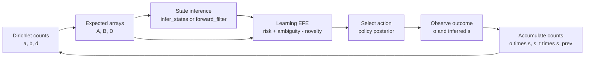
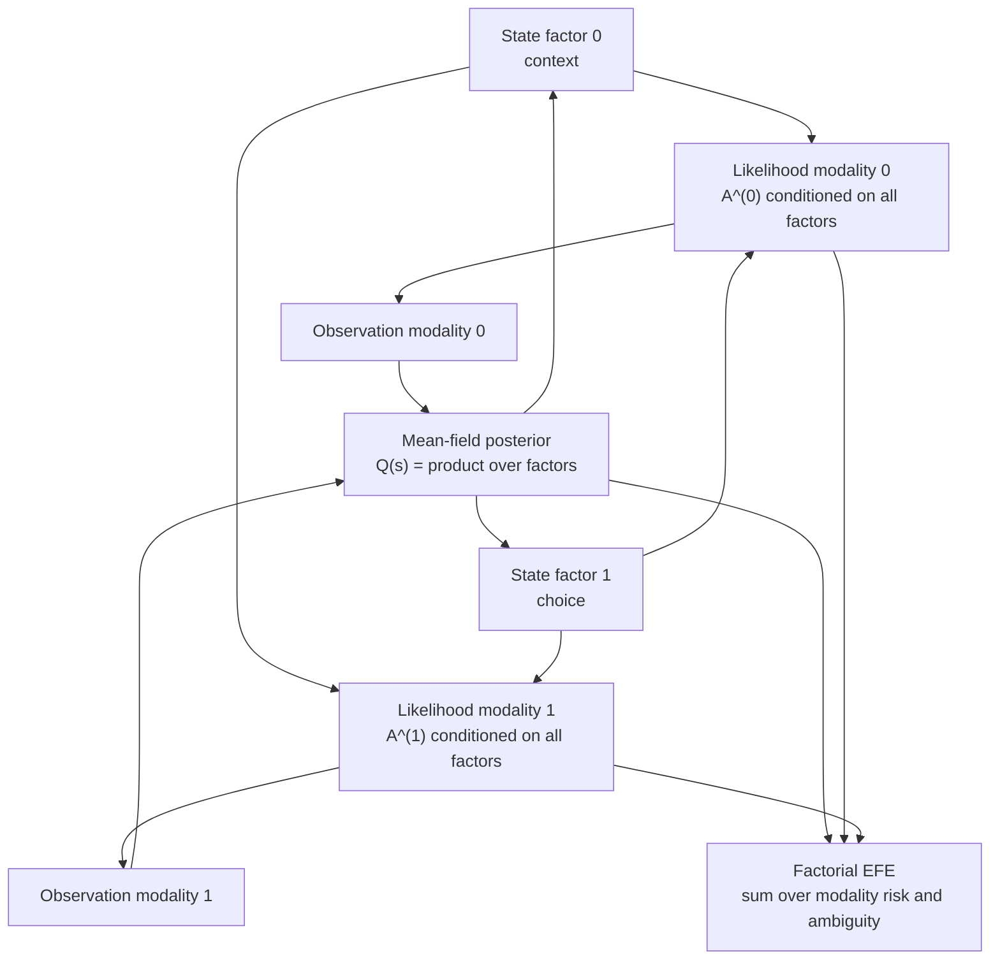

# Chapter 10 — concept map

Chapter 9 assumed the POMDP matrices `A`, `B`, `D` were *known*. Chapter 10 makes them
**unknown** and learns them from experience. The key idea: put a **Dirichlet** prior on each
categorical array. Because the Dirichlet is the conjugate prior of the categorical, the
posterior after seeing data is *another Dirichlet whose concentration parameters are just the
prior plus counts* — so learning reduces to **counting co-occurrences**.

> **Implemented:** the full chapter. §10.1 — the Dirichlet update rules for `A`/`B`/`D`
> (Eq. 4–6), the **parameter information-gain (novelty)** term (Eq. 12–15), and the
> learning-augmented agent (Algorithm 10.1.1). §10.2 — **habit** (baseline prior `E`) and
> **policy precision** `γ`, including learning `γ` from a Gamma prior (Eq. 20–25). §10.3 —
> **factorial depth** (multiple state factors + observation modalities, the two-armed bandit
> Example 10.7). §10.4 — **hierarchical depth** (nested POMDP layers, Eq. 39–50). Verified
> against the book's worked Examples 10.1–10.7 plus reduction/self-consistency oracles for the
> factorial and hierarchical machinery.

## Script inventory

| File | Role |
|---|---|
| `example_10_1_learn_D.py` | Dirichlet learning for the initial-state prior `D`. |
| `example_10_2_learn_A.py` | Dirichlet learning for likelihood matrix `A`. |
| `example_10_3_learn_B.py` | Dirichlet learning for transition matrix `B`. |
| `example_10_4_novelty.py` | Parameter-novelty and learning-augmented EFE. |
| `example_10_5_precision.py` | Habit prior and policy precision sweeps. |
| `example_10_6_precision_learning.py` | Gamma-prior learning of policy precision. |
| `example_10_7_two_armed_bandit.py` | Factorial two-armed bandit. |
| `example_10_8_hierarchical.py` | Hierarchical POMDP depth. |
| `visualize_factorial_structure.py` | Factorial likelihood structure heatmaps. |
| `animation_learning.py` | Dirichlet learning animation. |
| `animation_precision.py` | Policy-precision animation. |
| `animation_bandit.py` | Two-armed bandit animation. |

## Parameters become random variables

In Chapter 9 the generative model was `P(o, s, π) = P(π) P(s⁽⁰⁾) Π P(o|s) Π P(s'|s,π)`. Now
the matrices themselves get priors (book Eq. 1–3):

```
P(o, s, π, θ) = P(θ) P(π) P_D(s⁽⁰⁾) Π_τ P_A(o⁽τ⁾|s⁽τ⁾) Π_τ P_B(s⁽τ⁾|s⁽τ⁻¹⁾,π)
P(θ) = P_ǎ(A) P_b̌(B) P_ď(D),  θ ∈ {A, B, D}
```

Each `P(·)` is a **Dirichlet** parameterized by concentration parameters (pseudocounts)
`ǎ`, `b̌`, `ď`. The variational parameter density factorizes as `Q(θ) = Q_a(A) Q_b(B) Q_d(D)`.

## Learning = counting (the update rules)

Minimizing variational free energy with respect to the parameters gives update rules with a
beautifully simple form (book Eq. 4, `∘` = outer product):

| Array | Accumulate over a trial | Refresh at trial end (Eq. 5) |
|-------|-------------------------|------------------------------|
| **A** (likelihood) | `a += Σ_τ o⁽τ⁾ ∘ s⁽τ⁾` | `A = a_ij / Σ_i a_ij` (column-normalize) |
| **B** (transition) | `b += Σ_τ s⁽τ⁾ ∘ s⁽τ⁻¹⁾` | `B = b_ij / Σ_i b_ij` per slice |
| **D** (state prior) | `d += s⁽⁰⁾` | `D = d / Σd` |

For action-dependent transitions a separate slice `B[u]` is updated, weighting the
state-pair counts by the policy posterior (Eq. 6). The refreshed array is the Dirichlet
**expected value** `E[Dir(α)] = α/Σα` — the probabilities we use on the next trial.

**Worked example (10.1, `D` learning).** Start uniform `d = [1, 1]`; each trial observe
`s⁽⁰⁾ = [0.9, 0.1]`. After one update `d = [1.9, 1.1]` (Eq. 7); after 49 updates
`d = [45.1, 5.9]`, so `D = [45.1, 5.9]/51 ≈ [0.884, 0.116]` (Eq. 8) — counting recovers the
true proportion. The companion reproduces these exactly
(`example_10_1_learn_D.py`, `learn_D_vector`).

**Confidence grows with counts.** The pseudocounts increase linearly with the number of
observed pairs (right panels of Figs 10.1.3/10.1.4). A large pseudocount means high
confidence: one more count barely moves the probability. This is the Dirichlet's built-in
notion of certainty, and it is exactly what the novelty term measures.

## Parameter novelty — exploration that learns (§10.1)

A Chapter-9 agent balances **reward-seeking** (risk) against **state information-seeking**
(ambiguity). A *learning* agent gains a third drive: **parameter information-seeking**
(novelty), the expected information gain about `A`/`B`/`D` from visiting a state. Using the
KL-divergence between the current Dirichlet and the one-extra-count Dirichlet (book Eq. 12):

```
W ≈ ½(1/a − 1/a₀),   a₀[:, j] = Σ_i a[i, j]   (column-sum, broadcast)
novelty = o · (W s),   o = A s = E[Dir(a)] s    (Eq. 13b/19)
```

`W` is large where a concentration parameter is small (few counts ⇒ much to learn) and
shrinks as pseudocounts grow. The novelty-augmented expected free energy (Eq. 15) is

```
G = (As)·(log As − log C)   +   H·s   −   (As)·(Ws)
    └──── risk ────┘            └ ambiguity ┘   └ novelty (A) ┘
```

Novelty is **subtracted** (it is a gain): a naive agent with low pseudocounts is pulled
toward the state–observation pairs it knows least about, learning its world before pursuing
preferences. The companion verifies the book's Example 10.4 oracle exactly:
`A = [[0.758, 0.048], [0.242, 0.952]]`, `W = [[0.048, 3.175], [0.473, 0.008]]`, and
`o·(Ws) = 0.483` (`parameter_novelty`, `novelty_matrix`).

## The learning algorithm (Algorithm 10.1.1)

Discrete active inference *with* learning wraps the Chapter-9 planning loop in a trial loop:

1. Fix `A`, `B`, `D` (from the current Dirichlet means) at the start of the trial.
2. Each step: infer the state (`s = σ(log A·o + log prior)`), score policies by the
   novelty-augmented EFE (Eq. 15), select an action, observe — and **accumulate** counts
   `a_counts += o ∘ s`, `b_counts += π·(s ∘ s_prev)`, `d_counts = s⁽⁰⁾`.
3. At the end of the trial, add the counts (`a += a_counts`, …) and refresh `A`, `B`, `D`.

`simulate_learning_agent` is a compact end-to-end demonstration: an agent starting from
uniform pseudocounts (knowing nothing about `A`) uses novelty to choose which mappings to
probe and converges on the true likelihood over trials.



## Habits and policy precision (§10.2)

Chapter 9 set the policy posterior equal to the EFE-derived prior, `Q(π) = σ(−γG)`. §10.2
augments policy selection with three ingredients (book Eq. 20–22):

```
Q(π) = σ(log E − F^{[p]} − γ G^{[p]})        (Eq. 22)
```

- **`F^{[p]}` — policy-dependent variational free energy.** EFE `G` scores the *expected*
  future; once observations arrive, the *actual* evidence each policy accrued is the VFE
  `F`. Including it corrects the EFE prior with what really happened (Eq. 20).
- **`E` — baseline prior / habit.** A learned bias toward certain policies (e.g. from
  experience or evolution). Uniform `E` ⇒ no bias; a peaked `E` shifts mass toward habitual
  policies (Eq. 21). Example 10.5 (Fig 10.2.3) shows both regimes; the companion reproduces
  its numbers exactly (uniform `E`, `γ=1.5` ⇒ `[0.053, 0.236, 0.499, 0.174, 0.039]`).
- **`γ` — policy precision.** A scalar confidence in `G`. At `γ=0` the EFE term vanishes and
  `Q(π)` is the pure habit/prior; as `γ` grows the posterior sharpens onto the lowest-EFE
  policy. `precision_policy_sweep` traces this (`animate_policy_precision` animates it).

**Learning the precision (Eq. 23–25).** `γ` itself can be learned by placing a Gamma prior
`P(γ) = Γ(γ; α=1, β)` on it and descending VFE in `γ`:

```
∂F/∂γ = (β − β₀) + (π − π₀)·(−G),   π₀ = σ(log E − γG),  π = σ(log E − F − γG)
β ← β − κ_γ ∂F/∂γ        (Eq. 24)
γ = α/β = 1/β            (Eq. 25, the Gamma mean)
```

The gradient tracks the mismatch between the policy prior `π₀` (before data) and posterior
`π` (after data). When the VFE evidence `F` is **close** to the EFE `G` the agent's
expectations were confirmed, so confidence rises (high `γ`); when `F` is **far** from `G`,
confidence falls (low `γ`) and the posterior leans on `F`/habits instead (book Example 10.6).
`learn_precision` iterates to a self-consistent fixed point (`∂F/∂γ → 0`). The exact
magnitudes (book `γ = 1.357` close, `0.493` far) depend on the Gamma prior rate `β₀` /
scaling from the supplemental-material derivation; we verify the self-consistent fixed point
and the close-⇒-higher-`γ` ordering rather than transcribe an unverifiable constant.

## Factorial depth — many factors, many modalities (§10.3)

A flat POMDP has one hidden-state vector and one observation. Real tasks usually have several
*independent* hidden **state factors** that jointly drive several **observation modalities**.
§10.3 promotes the arrays to *sets* (book Eq. 32–34):

```
A = {A^(0), …, A^(M)}   one likelihood per modality, A^(m): (O_m, C_0, …, C_N)
B = {B^(0), …, B^(N)}   one transition per state factor, B^(n): (C_n, C_n, U_n)
C = {C^(0), …, C^(M)}   one preference per modality;  D = {D^(0), …, D^(N)} priors per factor
```



Each `A^(m)` is conditioned on **all** state factors at once (axis 0 = observation, axes 1.. =
the factors) — so factors "mix" to generate observations. State inference is **mean-field**
over factors, `Q(s) = ∏_n Q(s^(n))` (Eq. 35). Each factor's posterior is its prior plus a
**likelihood message** that averages `log A^(m)` over the *other* factors' current marginals
(Eq. 36/37) — variational message passing:

```
s^(n) = σ( log prior^(n) + Σ_m (E_{s∖n}[log A^(m)]) · o^(m) )
```

Everything collapses to the Chapter 9 single-factor model when `N = M = 0`; the companion
verifies this exactly against the Eq. 15 weather posterior. The factorial expected free energy
sums risk + ambiguity over modalities (Eq. 38a):

```
G = Σ_m [ o^(m)·(log o^(m) − log C^(m)) + H^(m)·s ]   with  o^(m) = A^(m) contracted with all factors
```

A useful identity: `risk + ambiguity = (−o·log C) − I(o; s)` — the pragmatic (preference)
term **minus** the information gain about states. Minimizing `G` therefore maximizes both
preference alignment *and* epistemic value.

**The two-armed bandit (Example 10.7).** Two factors — a fixed **context** `{left-better,
right-better}` and a controllable **choice** `{start, hint, left, right}` — generate three
modalities (a *hint*, a *reward*, and a proprioceptive *choice* echo). The agent can sample a
hint (epistemic: a full bit of context information) or pull a machine (pragmatic: may win).
`make_two_armed_bandit` builds the `A`/`B`/`C`/`D` set (the reward preference `(0, −3, 4)` is
**softmax-normalized** per the book, p. 620); `simulate_two_armed_bandit` runs the
receding-horizon agent. It reliably **learns the hidden context** (belief → the true machine)
and **exploits** the better arm — the risk-averse agent (loss pref −3) resolves the context by
gambling on the machines themselves (book: "unlikely to take hints, instead pull levers").
The hint's epistemic value is verified to be the full `ln 2` nats of context info-gain.

## Hierarchical depth — nested time scales (§10.4)

§10.4 stacks POMDPs into `L+1` layers (book Eq. 39–50). The defining mechanism: a higher
layer's state sets the **initial-state prior** of the layer below (Eq. 42,
`P_D(s^[0,l] | s^[1,l+1])`), so a *slow* high-level state contextualizes *fast* low-level
dynamics — "nested time scales". Each layer keeps its own `A^[l]`, `B^[l]`, `C^[l]` and is
inverted by the same flat-POMDP machinery; per-layer VFE (Eq. 50) and per-layer EFE (Eq. 43)
are identical in form to the single-level case:

```
F^[π,τ,l] = s · (log s − log B[u]^[l] s^[τ−1] − log A^[l]·o)          (Eq. 50)
G^[π,τ,l] = o·(log o − log C^[l]) + H^[l]·s                          (Eq. 43)
π^[l]     = σ( log E − Σ_τ F^[π,τ,l] − Σ_τ G^[π,τ,l] )               (Eq. 49)
```

`HierarchicalPOMDP` holds the layer stack plus a **link** map per adjacent pair: `link[l]` is
a column-stochastic `(C_l, C_{l+1})` matrix, and the lower prior is `link[l] · s^[l+1]`.
`simulate_hierarchical_agent` runs a two-layer nested rollout: each macro-step the slow top
layer filters its observation, its belief is pushed down to seed the fast bottom layer, and
the bottom layer filters `inner_steps` observations from that contextualized prior. The
companion verifies the per-layer VFE/EFE reduce to the flat versions and that the top regime
demonstrably steers the bottom layer's prior (the book gives no numerical oracle for §10.4, so
verification is by reduction + this constructed top-down-control demonstration).

## API used

| Concept | Symbol |
|---------|--------|
| Dirichlet expected value (Eq. 5) | `dirichlet_expected_value`, `expected_A`, `expected_B`, `expected_D` |
| Count accumulation (Eq. 4) | `accumulate_a_counts`, `accumulate_b_counts`, `accumulate_d_counts` |
| Parameter novelty (Eq. 12–13) | `novelty_matrix`, `parameter_novelty` |
| Novelty-augmented EFE (Eq. 15) | `efe_with_novelty` |
| Learning containers / sims | `DirichletParameters`, `LearningResult`, `learn_D_vector`, `simulate_array_learning`, `simulate_learning_agent` |
| Habit + precision (§10.2, Eq. 20–25) | `policy_posterior_full`, `precision_gradient`, `learn_precision`, `PrecisionResult`, `precision_policy_sweep` |
| Factorial depth (§10.3, Eq. 32–38) | `FactorialPOMDP`, `factorial_expected_observation`, `factorial_likelihood_message`, `factorial_infer_states`, `factorial_predict_states`, `factorial_modality_ambiguity`, `factorial_efe`, `make_two_armed_bandit`, `simulate_two_armed_bandit`, `TwoArmedBanditResult` |
| Hierarchical depth (§10.4, Eq. 39–50) | `HierarchicalPOMDP`, `hierarchical_layer_vfe`, `hierarchical_layer_efe`, `hierarchical_policy_posterior`, `simulate_hierarchical_agent`, `HierarchicalResult` |
| Figures | `unified.plot_parameter_learning`, `unified.plot_two_armed_bandit`, `unified.plot_factorial_likelihood`, `unified.plot_hierarchical_timescales` |
| Animations | `animate_parameter_learning`, `animate_policy_precision`, `animate_two_armed_bandit` |

## Verification

Every claim is checked against an oracle (see `tests/core/test_pomdp.py::TestDirichletLearning`,
`tests/estimators/test_pomdp.py::TestParameterLearning`):

- **Example 10.1 (`D`)**: `learn_D_vector` reproduces `d = [45.1, 5.9]`, `D ≈ [0.884, 0.116]`.
- **Example 10.4 (novelty)**: `novelty_matrix` and `parameter_novelty` reproduce
  `W = [[0.048, 3.175], [0.473, 0.008]]` and `o·(Ws) = 0.483` to 3 decimals.
- **Examples 10.2/10.3 (`A`/`B`)**: `simulate_array_learning` converges to the true arrays
  (max abs error < 0.05) with monotonically growing confidence.
- **Algorithm 10.1.1**: `simulate_learning_agent` learns `A` to < 0.1 error driven by a
  positive trial-0 novelty.
- **Example 10.5 (§10.2)**: `policy_posterior_full` reproduces Fig 10.2.3 exactly (uniform
  `E`, `γ=1.5` ⇒ `[0.053, 0.236, 0.499, 0.174, 0.039]`; strong `E`, `γ=0` ⇒
  `[0.154, 0.308, 0.077, 0.308, 0.154]`).
- **Example 10.6 (§10.2)**: `learn_precision` converges to a self-consistent fixed point
  (`∂F/∂γ ≈ 0`) with the book's close-⇒-higher-`γ` ordering.
- **Factorial (§10.3)** (`tests/core/test_pomdp.py::TestFactorialDepth`,
  `tests/estimators/test_pomdp.py::TestTwoArmedBandit`): `factorial_infer_states` and
  `factorial_efe` reduce **exactly** to the Chapter 9 single-factor case (Eq. 15 posterior);
  mean-field factors stay independent; the two-armed bandit agent learns the true context
  (belief → the right machine for both contexts) and exploits it, and the hint carries `ln 2`
  nats of context info-gain.
- **Hierarchical (§10.4)** (`tests/core/test_pomdp.py::TestHierarchicalDepth`,
  `tests/estimators/test_pomdp.py::TestHierarchicalAgent`): `hierarchical_layer_vfe` /
  `hierarchical_layer_efe` reduce to the flat `discrete_vfe` / `expected_free_energy`; the
  top-down prior equals the link column; the top regime demonstrably steers the bottom prior.
