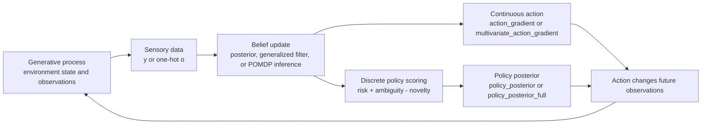

# Active inference

Active inference is a framework for modeling agents that *minimize a single
objective* — variational free energy — by choosing both their internal
beliefs and their actions in the world. Perception updates beliefs to make
them consistent with observations; action changes the world to make
observations consistent with beliefs. Together they form a closed loop
governed by one optimization principle.

This article is the bridge between the Bayesian-inference machinery the
package already ships and the broader theory readers will meet later in
the book. Everything shown here is implementable today with classes and
functions in `active_inference`.

## The four ingredients

Every active-inference model needs:

1. **A generative process** — the environment that produces observations.
   In this codebase: `LinearGaussianProcess`, `LinearGaussianMVProcess`,
   `ActiveEnvironment`, `MultivariateActiveEnvironment`, or a POMDP
   transition model.
2. **A generative model** — the agent's beliefs about that environment.
   `LinearGaussianModel`, `DynamicStateSpaceModel`,
   `GeneralizedVectorModel`, `POMDPModel`, `FactorialPOMDP`, and
   `HierarchicalPOMDP` are the main concrete forms.
3. **A perception step** — invert the model to obtain a posterior over
   hidden states. This can be exact grid/LGS inference, generalized
   filtering, predictive coding, or categorical POMDP state inference.
4. **An action / policy step** — change the environment, or choose a
   policy, so future observations fit preferences. Continuous examples
   use `ActiveInferenceAgent`; discrete examples use expected free
   energy and `policy_posterior`.

The first three ingredients are the *passive* agent of Part I of the
book; adding the fourth makes the agent *active*.

## Implemented control patterns

The repository now contains both continuous and discrete active-inference
loops. They share the same modeling split, but action is represented
differently: as a continuous control signal in Chapter 7 and as a policy
posterior in Chapters 9-10.



## How the codebase realizes the loop

```python
import numpy as np
from active_inference import (
    ActiveEnvironment, ActiveInferenceAgent, DynamicStateSpaceModel,
    LinearFunction, simulate_active_inference,
)

env = ActiveEnvironment(
    drift=LinearFunction(-1.0, 10.0),  # world is pulled toward v* = 10
    g=LinearFunction(1.0, -3.0),
)
model = DynamicStateSpaceModel(
    f=LinearFunction(-1.0, 0.0),       # agent prefers v = 0
    g=LinearFunction(1.0, -3.0),
    s2_x=1.0,
    sigma2_y=0.05,
)
agent = ActiveInferenceAgent(model, forward_model=1.0, kappa_x=0.2, kappa_a=0.4)
res = simulate_active_inference(
    agent, env, x0=5.0, mu0=5.0, n_steps=6000,
    action_start=2000, rng=np.random.default_rng(0),
)
print(res.settled_state(), res.settled_action())  # approx 0, approx -10
```

The same principle appears in discrete form in Chapters 9-10: policies are
scored by expected free energy (`risk + ambiguity`, optionally minus novelty),
then converted into a posterior with `policy_posterior` or
`policy_posterior_full`.

## Markov blankets in this codebase

A Markov blanket separates *internal* states (what the agent computes)
from *external* states (what generates the data) by way of *blanket*
states (sensory inputs and actions). The package's separation between
`generative_process` and `generative_model` already enforces this
distinction: the model never *samples* from the environment, the process
never *evaluates* the model's densities.

| Layer | What it is | What it can do |
|---|---|---|
| External | true state ``x*`` / POMDP state | sampled or transitioned by process/environment code |
| Sensory  | observed ``y`` / one-hot ``o`` | assimilated by perception or state inference |
| Internal | belief ``μ`` / categorical posterior ``s`` | `InferenceResult`, generalized-filter traces, POMDP beliefs |
| Active   | action ``a`` / policy ``π`` | continuous action gradients or EFE-scored policies |

## Information-theoretic bookkeeping

Active inference takes information theory at face value. Every quantity
listed below is a one-liner with the helpers in `core.diagnostics`:

| Quantity | Identifier | Reading |
|---|---|---|
| Posterior entropy | `result.entropy()` | uncertainty in the current belief |
| Belief update size | `result.kl_from_prior()` | KL[posterior ‖ prior]; how much the data moved the agent |
| Forecast quality | `log_score_gaussian`, `crps_gaussian` | proper scoring rules of the predictive |
| Calibration of the agent | `calibration_curve` | whether credible regions cover at the nominal rate |
| Replicate agreement | `posterior_predictive_check` | does data we'd simulate look like data we saw |

These are the bookkeeping entries the agent's loop ought to track. In
the running-stats helper they all appear as functions of ``N``.

## Pitfalls

- **Continuous and discrete action differ.** Chapter 7 action is a
  continuous control signal descending free energy through the sensory
  channel. Chapters 9-10 choose categorical policies by expected free
  energy. Do not mix those interfaces.
- **Free energy in the package is *variational* free energy** computed
  on a grid for 1-D models. Closed-form Gaussian KL +
  `gaussian_entropy_*` give analytic bounds for the multivariate case.
- **The blanket separation is a convention, not a runtime barrier.**
  Mixing process methods into model code will silently work but break
  the abstraction. Stay disciplined about which side you're on.

## See also

- [`free_energy_principle.md`](free_energy_principle.md) — what the
  agent is minimizing.
- [`bayesian_mechanics.md`](bayesian_mechanics.md) — the
  density-dynamics formalism behind the loop.
- [`bayesian_inference.md`](bayesian_inference.md) — the inversion step.
- [`generative_models.md`](generative_models.md) — the process/model
  split the Markov blanket leans on.
- [`../reference/core.md`](../reference/core.md) — `Pipeline`,
  `running_stats`, `LinearGaussianSystem`, and the full diagnostics
  table.
