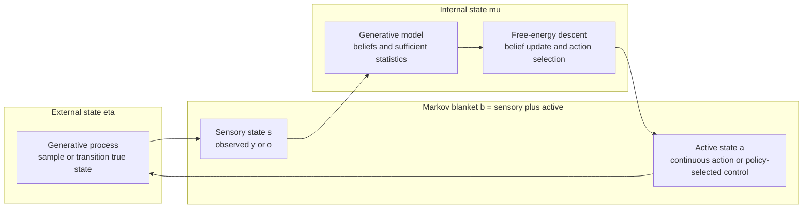

# Bayesian mechanics

Bayesian mechanics is the *dynamical* counterpart of the free energy
principle. Where the FEP describes *what* a self-organizing system
optimizes, Bayesian mechanics describes *how* its states flow over time
so that they end up doing it. The key construct is a Markov blanket
that decomposes the world into internal, blanket, and external states,
plus a flow on those states that, on average, descends the variational
free energy.

This article is the third corner of the triangle with
[`active_inference.md`](active_inference.md) and
[`free_energy_principle.md`](free_energy_principle.md). It summarizes
the formalism and grounds it in what the package can actually compute.

## The four state classes

Pick any system whose state vector ``s`` factors into four disjoint
groups:

| Class | Symbol | What it does | This codebase |
|---|---|---|---|
| External | ``η`` | true generators of data | process/environment state (`LinearGaussianProcess`, `ActiveEnvironment`, POMDP transitions) |
| Sensory | ``s`` | inputs the agent observes | scalar/vector ``y`` or one-hot categorical ``o`` |
| Active | ``a`` | outputs that perturb the environment | continuous `actions` in Chapter 7 or discrete policies in Chapters 9-10 |
| Internal | ``μ`` | sufficient statistics of the agent's belief | `InferenceResult`, generalized-filter beliefs, POMDP posteriors |

The Markov blanket is ``b = (s, a)``: blanket states screen the internal
states from the external ones, in the sense that
``p(η, μ | b) = p(η | b) p(μ | b)``. In code, the package's strict
process / model split *is* the blanket — the model never reads ``η``
directly, only ``s = y``.



## The density-dynamics picture

A Bayesian-mechanics agent has internal states whose flow approximates
gradient descent on the variational free energy:

```
dμ/dt  ≈  −κ ∇_μ F[ q_μ ; s ]
```

where ``q_μ`` is the variational density indexed by the internal states
``μ`` (e.g. ``μ`` could be ``(mean, log_variance)`` for a Gaussian
``q``). For the linear-Gaussian world the package targets, the
gradient has a closed form, and the descent is realized in two
equivalent ways:

1. **Closed-form jump** (one-step Bayes update). Used by
   `LinearGaussianSystem.posterior` /
   `BayesianLinearRegression.fit`.
2. **Iterative descent** (gradient flow approximation). Used by
   `gradient_descent`, `gd_linear_regression`, and the EM loop in
   `fit_factor_analysis`.

The first is the limit of the second as the step size approaches the
Newton step. Both achieve the same minimum of ``F``. In the active
examples, the same descent view extends to action: Chapter 7 updates
``a`` through the sensory channel, while Chapters 9-10 evaluate policy
trajectories by expected free energy.

## Worked example: a tiny Bayesian-mechanics loop

```python
import numpy as np
from active_inference import (
    Pipeline, gaussian_kl_univariate,
)

pipe = Pipeline.linear_gaussian(
    beta0=3.0, beta1=2.0, sigma2_y=0.4,
    m_x=4.0, s2_x=1.0,
    rng=np.random.default_rng(0),
)

# Internal state μ_t = (mean_t, var_t). Each new sensory input shifts μ
# along the gradient flow.
mean, var = pipe.model.m_x, pipe.model.s2_x
trace = []
for t in range(40):
    y = float(pipe.process.sample(x_star=2.0, n=1)[0])
    # Closed-form Gaussian update — the limit of the gradient flow.
    obs_var = pipe.model.sigma2_y
    new_var = 1.0 / (1.0 / var + 1.0 / obs_var)
    new_mean = new_var * (mean / var + (y - 3.0) / 2.0 / obs_var * 4.0)
    # Free-energy proxy: KL[q_t ‖ q_{t-1}] — how much μ moved this step.
    delta_F = gaussian_kl_univariate(new_mean, new_var, mean, var)
    trace.append((t, mean, var, delta_F))
    mean, var = new_mean, new_var

# `delta_F` should drop toward zero — internal states are settling.
```

Each step the internal state moves *less* than the previous one, which
is the discrete-time fingerprint of a gradient flow approaching a fixed
point.

## What the package gives you for free

| Bayesian-mechanics concept | Identifier | Use it for |
|---|---|---|
| External / sensory split | process/environment classes ↔ model/agent classes | keep world dynamics separate from beliefs |
| Internal sufficient statistics | `InferenceResult`, generalized-filter result traces, POMDP beliefs | track ``μ_t`` or ``s_t`` |
| Step-by-step internal flow | `running_stats`, `generalized_filter`, `simulate_active_inference` | trajectories of beliefs over time |
| Free-energy proxy ``ΔF`` | `gaussian_kl_univariate`, `gaussian_kl_mvn`, VFE traces | ``KL[q_t ‖ q_{t−1}]`` or explicit free-energy descent |
| Action / policy flow | `action_gradient`, `multivariate_action_gradient`, `policy_posterior` | perturb the environment or select policies by free energy |
| Long-run uncertainty | `InferenceResult.entropy()`, `gaussian_entropy_*`, categorical EFE terms | settled-state uncertainty and policy value |

## Convergence diagnostics

Two scalar checks are useful for confirming the internal flow is
behaving:

1. ``ΔF[μ_t‖μ_{t−1}]`` shrinks monotonically (after a transient). A
   flat or growing trace usually means the model is mis-specified.
2. ``KL[posterior ‖ prior]`` plateaus once the data has been fully
   absorbed. A constantly-rising KL means the prior is being overrun —
   not a bug, but a signal to widen the prior or tighten the
   likelihood.

Both traces are returned by `running_stats`, animated by
`animate_sufficient_statistics`, and plotted statically by
`plot_kl_trace` and `plot_running_statistics`.

## Pitfalls

- **Markov blanket ≠ formal proof of separation.** The package's
  process / model split is a *convention* — it is not enforced by the
  type system. Don't read posterior densities from inside a process
  subclass and expect the abstraction to hold.
- **The flow analogy is local.** Closed-form Gaussian updates are
  one-shot; the gradient-descent picture is only literal for non-Gaussian
  problems where the analytic posterior is unavailable.
- **Stationarity depends on the example.** Part-I running statistics
  assume a fixed true state. Chapters 6-8 handle drifting continuous
  states with online generalized filtering; use those APIs instead of
  accumulating all past samples when the world is moving.
- **One agent ≠ many agents.** Multi-agent Bayesian mechanics requires
  cross-agent blankets and a notion of joint free energy. Not in scope
  for this companion.

## See also

- [`active_inference.md`](active_inference.md) — the loop driven by
  the flow.
- [`free_energy_principle.md`](free_energy_principle.md) — what the
  flow descends.
- [`generative_models.md`](generative_models.md) — the process / model
  split that embodies the blanket.
- [`learning_and_inference.md`](learning_and_inference.md) — closed
  form vs iterative gradient flow.
- [`../reference/core.md`](../reference/core.md) — `Pipeline`,
  `running_stats`, KL helpers, entropy helpers.
