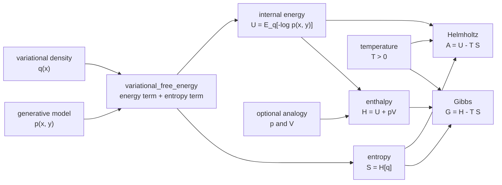

# Thermodynamic Bridge

The thermodynamic bridge is an explicit analogy layer, not a claim that every
active-inference model has physical pressure-volume work. It gives names to the
terms already present in variational free energy and adds optional thermodynamic
potentials for cross-topic extras.

## Mapping

For a generative model `p(x, y)` and variational density `q(x)`:

```text
U = E_q[-log p(x, y)]
S = H[q]
A = U - T S
```

At `T = 1`, `p = 0`, and `V = 0`, the Helmholtz form `A = U - T S` equals the
existing variational free energy calculation:

```text
F[q] = E_q[log q(x) - log p(x, y)]
     = E_q[-log p(x, y)] - H[q]
     = U - S
```

Pressure and volume are supplied by the caller only when the analogy is useful:

```text
H = U + pV
G = H - T S
```

## Flow

The bridge reuses the existing Chapter 4 VFE calculation. It changes the names
and optional thermodynamic knobs around those terms; it does not introduce a
new inference algorithm or claim that pressure-volume work is inherent to every
active-inference model.



## API

| Function | Purpose |
|---|---|
| `vfe_thermodynamic_state` | Convert a VFE calculation into `U`, `S`, `T`, `p`, `V`. |
| `ThermodynamicState` | Store one state and derive `A`, `H`, and `G`. |
| `canonical_probabilities` | Compute temperature-scaled Boltzmann probabilities. |
| `expected_energy` | Compute `U` from probabilities and energy levels. |
| `boltzmann_entropy` | Compute `S = -sum p log p`. |
| `helmholtz_free_energy` | Compute `A = U - T S`. |
| `enthalpy` | Compute `H = U + pV`. |
| `gibbs_free_energy` | Compute `G = H - T S`. |

## Example

```python
import numpy as np
from active_inference import (
    GaussianBelief,
    LinearGaussianModel,
    vfe_thermodynamic_state,
    variational_free_energy,
)

model = LinearGaussianModel(beta0=3, beta1=2, sigma2_y=0.25, m_x=4, s2_x=0.25)
x_grid = np.linspace(-6, 12, 2001)
q = GaussianBelief(mu=2.4, var=0.05)

components = variational_free_energy(q, model, 7.0, x_grid)
state = vfe_thermodynamic_state(q, model, 7.0, x_grid)

assert np.isclose(state.helmholtz_free_energy, components.free_energy)
```

## Extras

The runnable extras are:

- `extras/temperature/visualize_temperature.py`
- `extras/temperature/simulate_temperature.py`
- `extras/enthalpy/visualize_enthalpy.py`
- `extras/enthalpy/simulate_enthalpy.py`
- `extras/variational_free_energy/visualize_variational_free_energy.py`
- `extras/variational_free_energy/simulate_variational_free_energy.py`
- `extras/variational_free_energy/animation_variational_free_energy.py`
- the broader thermodynamic/FEP family listed in
  [`../reference/book_topic_matrix.md`](../reference/book_topic_matrix.md)

Each accepts `--save` and exports NPZ+JSON raw data under
`output/data/extras/<topic>/`.

## See also

- [`free_energy_principle.md`](free_energy_principle.md)
- [`../statistics/entropy.md`](../statistics/entropy.md)
- [`../statistics/divergences.md`](../statistics/divergences.md)
- [`../reference/core.md`](../reference/core.md)
