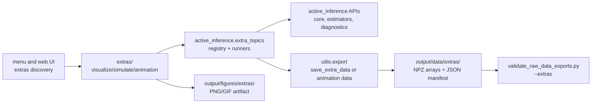

# `extras/` - Book-Grounded Topic Curriculum Beyond The Chapters

This section contains cross-cutting topic demos that sit beside, not inside, the Chapter 1-10 reproduction spine. Each topic folder is a thin runnable orchestrator over tested `src/active_inference` APIs. The curriculum is grounded in the attached Namjoshi manuscript across Chapters 1-14 plus the math and free-energy appendices.

Saved extras figures land in `output/figures/extras/<topic>/`. Raw numerical sidecars land in `output/data/extras/<topic>/` as paired NPZ and JSON files.

## Topic Families

### Foundations

| Topic | Scripts | Book sections | Focus |
|---|---|---|---|
| [`model_representation/`](model_representation/) | `visualize_model_representation.py` | 1.1 | How internal representations stand in for hidden causes. |
| [`order_and_surprisal/`](order_and_surprisal/) | `visualize_order_and_surprisal.py`, `simulate_order_and_surprisal.py` | 1.2, 14.3 | Order as low-surprisal occupancy over viable states. |
| [`bayes_equation/`](bayes_equation/) | `visualize_bayes_equation.py`, `simulate_bayes_equation.py` | 1.3, 2.1.4, C.2.4 | Prior, likelihood, evidence, posterior, and normalization. |
| [`inverse_problem/`](inverse_problem/) | `visualize_inverse_problem.py`, `simulate_inverse_problem.py` | 1.4, 2.1.4 | Recovering hidden states from observations under a generative model. |
| [`generative_process_model/`](generative_process_model/) | `visualize_generative_process_model.py`, `simulate_generative_process_model.py` | 2.1.2, 2.1.3, B.4 | Contrasting the data-generating process with the agent's model. |
| [`precision_weighting/`](precision_weighting/) | `visualize_precision_weighting.py`, `simulate_precision_weighting.py` | 2.2, 5.1, 10.2 | Variance, precision, and their control over belief updates. |
| [`hidden_state_estimation/`](hidden_state_estimation/) | `visualize_hidden_state_estimation.py`, `simulate_hidden_state_estimation.py`, `animation_hidden_state_estimation.py` | 2.2, 2.3 | Sequential inference over latent states. |

### Statistical Estimation

| Topic | Scripts | Book sections | Focus |
|---|---|---|---|
| [`multiple_samples/`](multiple_samples/) | `visualize_multiple_samples.py`, `simulate_multiple_samples.py` | 2.3 | How repeated observations tighten posterior beliefs. |
| [`mle_map/`](mle_map/) | `visualize_mle_map.py`, `simulate_mle_map.py` | 2.5.1 | Likelihood-only and prior-regularized point estimates. |
| [`gradient_descent/`](gradient_descent/) | `visualize_gradient_descent.py`, `simulate_gradient_descent.py`, `animation_gradient_descent.py` | 2.5.2, 3.1 | Iterative descent on a differentiable loss surface. |
| [`linear_regression/`](linear_regression/) | `visualize_linear_regression.py`, `simulate_linear_regression.py` | 3.1, 3.2 | Deterministic parameter estimation and residual geometry. |
| [`bayesian_linear_regression/`](bayesian_linear_regression/) | `visualize_bayesian_linear_regression.py`, `simulate_bayesian_linear_regression.py`, `animation_bayesian_linear_regression.py` | 3.3 | Posterior parameter uncertainty and predictive bands. |
| [`multivariate_gaussians/`](multivariate_gaussians/) | `visualize_multivariate_gaussians.py`, `simulate_multivariate_gaussians.py` | 3.4, C.10 | Covariance geometry, entropy, and KL in multiple dimensions. |
| [`linear_gaussian_systems/`](linear_gaussian_systems/) | `visualize_linear_gaussian_systems.py`, `simulate_linear_gaussian_systems.py`, `animation_linear_gaussian_systems.py` | 3.4 | State-space prediction and filtering under linear Gaussian assumptions. |
| [`expectation_maximization/`](expectation_maximization/) | `visualize_expectation_maximization.py`, `simulate_expectation_maximization.py`, `animation_expectation_maximization.py` | 3.5 | Alternating latent expectation and parameter maximization. |

### Information And Variational Inference

| Topic | Scripts | Book sections | Focus |
|---|---|---|---|
| [`entropy/`](entropy/) | `visualize_entropy.py`, `simulate_entropy.py` | C.10.4, 14.3 | Discrete and differential entropy, including negative differential cases. |
| [`kl_divergence/`](kl_divergence/) | `visualize_kl_divergence.py`, `simulate_kl_divergence.py` | 4.1, C.10.5 | Asymmetric divergence and posterior approximation loss. |
| [`surprisal_evidence/`](surprisal_evidence/) | `visualize_surprisal_evidence.py`, `simulate_surprisal_evidence.py` | 4.2, 4.3 | Evidence, negative log evidence, and bound gaps. |
| [`variational_free_energy/`](variational_free_energy/) | `visualize_variational_free_energy.py`, `simulate_variational_free_energy.py`, `animation_variational_free_energy.py` | 4.2, 4.3, D.1 | Energy, entropy, KL, and surprisal decompositions of VFE. |
| [`mean_field_variational_inference/`](mean_field_variational_inference/) | `visualize_mean_field_variational_inference.py`, `simulate_mean_field_variational_inference.py` | 4.5, 4.6 | Factorized approximations and coordinate updates. |
| [`cavi/`](cavi/) | `visualize_cavi.py`, `simulate_cavi.py`, `animation_cavi.py` | 4.5, 12.4 | Coordinate-ascent updates as repeated local message refinement. |
| [`model_comparison/`](model_comparison/) | `visualize_model_comparison.py`, `simulate_model_comparison.py` | 4.4, C.11.1 | Evidence and Bayes-factor style comparison across models. |

### Predictive Coding And Continuous Dynamics

| Topic | Scripts | Book sections | Focus |
|---|---|---|---|
| [`predictive_coding/`](predictive_coding/) | `visualize_predictive_coding.py`, `simulate_predictive_coding.py`, `animation_predictive_coding.py` | 5.1, 5.2 | Prediction errors and recognition dynamics. |
| [`hierarchical_predictive_coding/`](hierarchical_predictive_coding/) | `visualize_hierarchical_predictive_coding.py`, `simulate_hierarchical_predictive_coding.py`, `animation_hierarchical_predictive_coding.py` | 5.4, 8.3 | Layered prediction-error propagation. |
| [`generalized_filtering/`](generalized_filtering/) | `visualize_generalized_filtering.py`, `simulate_generalized_filtering.py`, `animation_generalized_filtering.py` | 6.1, 6.2 | Dynamic state inference with generalized filtering. |
| [`generalized_coordinates/`](generalized_coordinates/) | `visualize_generalized_coordinates.py`, `simulate_generalized_coordinates.py` | 6.3, 6.5, 6.6 | State, velocity, and higher-order embedding orders. |

### Active Inference Core

| Topic | Scripts | Book sections | Focus |
|---|---|---|---|
| [`active_generalized_filtering/`](active_generalized_filtering/) | `visualize_active_generalized_filtering.py`, `simulate_active_generalized_filtering.py`, `animation_active_generalized_filtering.py` | 7.2, 7.4, 7.5 | Action and perception as coupled free-energy descent. |
| [`learning_attention/`](learning_attention/) | `visualize_learning_attention.py`, `simulate_learning_attention.py`, `animation_learning_attention.py` | 8.1 | Learning first- and second-order parameters through precision. |
| [`hierarchical_message_passing/`](hierarchical_message_passing/) | `visualize_hierarchical_message_passing.py`, `simulate_hierarchical_message_passing.py`, `animation_hierarchical_message_passing.py` | 8.5, 12.5 | Forward and backward messages across hierarchical layers. |

### Discrete POMDP Active Inference

| Topic | Scripts | Book sections | Focus |
|---|---|---|---|
| [`pomdp_arrays/`](pomdp_arrays/) | `visualize_pomdp_arrays.py`, `simulate_pomdp_arrays.py` | 9.1, B.10 | D, A, B, C, and E arrays as discrete generative-model components. |
| [`discrete_belief_filtering/`](discrete_belief_filtering/) | `visualize_discrete_belief_filtering.py`, `simulate_discrete_belief_filtering.py`, `animation_discrete_belief_filtering.py` | 9.2 | Dynamic categorical belief updates over time. |
| [`discrete_vfe/`](discrete_vfe/) | `visualize_discrete_vfe.py`, `simulate_discrete_vfe.py` | 9.3 | Discrete free energy for hidden-state estimation. |
| [`gridworld_control/`](gridworld_control/) | `visualize_gridworld_control.py`, `simulate_gridworld_control.py`, `animation_gridworld_control.py` | 9.4, 9.5 | Planning as inference in controllable grid-world transitions. |
| [`expected_free_energy/`](expected_free_energy/) | `visualize_expected_free_energy.py`, `simulate_expected_free_energy.py` | 9.5, D.3 | Risk, ambiguity, and epistemic value in policy scoring. |
| [`exploration_exploitation/`](exploration_exploitation/) | `visualize_exploration_exploitation.py`, `simulate_exploration_exploitation.py`, `animation_exploration_exploitation.py` | 9.6, 10.1 | Policy choice as a tradeoff between information and preference satisfaction. |

### Learning And Depth

| Topic | Scripts | Book sections | Focus |
|---|---|---|---|
| [`dirichlet_learning/`](dirichlet_learning/) | `visualize_dirichlet_learning.py`, `simulate_dirichlet_learning.py`, `animation_dirichlet_learning.py` | 10.1 | Pseudocount accumulation for POMDP parameter learning. |
| [`policy_precision_habits/`](policy_precision_habits/) | `visualize_policy_precision_habits.py`, `simulate_policy_precision_habits.py`, `animation_policy_precision_habits.py` | 10.2 | Policy precision and baseline habits in action selection. |
| [`factorial_depth/`](factorial_depth/) | `visualize_factorial_depth.py`, `simulate_factorial_depth.py` | 10.3, 12.6 | Multiple state factors and observation modalities. |
| [`hierarchical_depth/`](hierarchical_depth/) | `visualize_hierarchical_depth.py`, `simulate_hierarchical_depth.py` | 10.4, 12.6 | Nested policies and slower contextual layers. |

### Part III Extensions

| Topic | Scripts | Book sections | Focus |
|---|---|---|---|
| [`free_energy_variants/`](free_energy_variants/) | `visualize_free_energy_variants.py`, `simulate_free_energy_variants.py` | 11.1, D | FEF, OFE, PFE, FEEF, generalized, Bethe, and Renyi forms. |
| [`sophisticated_inference/`](sophisticated_inference/) | `visualize_sophisticated_inference.py`, `simulate_sophisticated_inference.py` | 11.2.1 | Planning with beliefs over future belief updates. |
| [`inductive_planning/`](inductive_planning/) | `visualize_inductive_planning.py`, `simulate_inductive_planning.py` | 11.2.2 | Policy search that reuses substructure across paths. |
| [`state_preferences/`](state_preferences/) | `visualize_state_preferences.py`, `simulate_state_preferences.py` | 11.2.3, 11.2.5 | Preferences over states and time-dependent preference schedules. |
| [`parameter_uncertainty/`](parameter_uncertainty/) | `visualize_parameter_uncertainty.py`, `simulate_parameter_uncertainty.py` | 11.2.6, 11.2.7 | Forgetting rates and uncertainty on learned parameters. |
| [`backward_smoothing/`](backward_smoothing/) | `visualize_backward_smoothing.py`, `simulate_backward_smoothing.py`, `animation_backward_smoothing.py` | 11.2.9, 12.3 | Backward messages that refine earlier state beliefs. |
| [`hybrid_generative_models/`](hybrid_generative_models/) | `visualize_hybrid_generative_models.py`, `simulate_hybrid_generative_models.py` | 11.3, 12.6 | Continuous and discrete state-space components in one model. |
| [`tree_policy_search/`](tree_policy_search/) | `visualize_tree_policy_search.py`, `simulate_tree_policy_search.py`, `animation_tree_policy_search.py` | 11.4 | Tree-based optimization and receding policy search. |
| [`structure_learning/`](structure_learning/) | `visualize_structure_learning.py`, `simulate_structure_learning.py` | 11.5 | Comparing candidate model structures through evidence-like scores. |

### Factor Graphs And Applications

| Topic | Scripts | Book sections | Focus |
|---|---|---|---|
| [`factor_graphs/`](factor_graphs/) | `visualize_factor_graphs.py`, `simulate_factor_graphs.py` | 12.1, 12.5 | Forney factor graphs as model diagrams for message passing. |
| [`belief_propagation/`](belief_propagation/) | `visualize_belief_propagation.py`, `simulate_belief_propagation.py`, `animation_belief_propagation.py` | 12.2, 12.3 | Sum-product messages for state-space models. |
| [`variational_message_passing/`](variational_message_passing/) | `visualize_variational_message_passing.py`, `simulate_variational_message_passing.py` | 12.4 | Mean-field updates expressed as local messages. |
| [`robotics_navigation/`](robotics_navigation/) | `visualize_robotics_navigation.py`, `simulate_robotics_navigation.py`, `animation_robotics_navigation.py` | 13.1, 13.2 | Navigation and control as preference-seeking active inference. |
| [`social_robotics/`](social_robotics/) | `visualize_social_robotics.py`, `simulate_social_robotics.py` | 13.3 | Belief updates over another agent's hidden intention. |

### Thermodynamic/FEP Bridge

| Topic | Scripts | Book sections | Focus |
|---|---|---|---|
| [`ergodic_density/`](ergodic_density/) | `visualize_ergodic_density.py`, `simulate_ergodic_density.py`, `animation_ergodic_density.py` | 14.1, 14.2 | Long-run occupancy as a density over viable states. |
| [`fep_entropy_bounds/`](fep_entropy_bounds/) | `visualize_fep_entropy_bounds.py`, `simulate_fep_entropy_bounds.py` | 14.3 | Entropy and VFE bounds for self-organizing systems. |
| [`temperature/`](temperature/) | `visualize_temperature.py`, `simulate_temperature.py` | D, 14.3 | Temperature-scaled canonical probabilities and U - T S. |
| [`enthalpy/`](enthalpy/) | `visualize_enthalpy.py`, `simulate_enthalpy.py` | D | H = U + pV and G = H - T S as explicit analogy-layer quantities. |
| [`bayesian_mechanics_bridge/`](bayesian_mechanics_bridge/) | `visualize_bayesian_mechanics_bridge.py`, `simulate_bayesian_mechanics_bridge.py` | 14.1, 14.4, A | A careful bridge between active inference, FEP, and Bayesian mechanics. |

## Run

```bash
uv run python extras/entropy/visualize_entropy.py --save
uv run python extras/expected_free_energy/simulate_expected_free_energy.py --save
uv run python extras/predictive_coding/animation_predictive_coding.py --save
uv run python -m active_inference.menu --extras
```

## Artifact Flow


